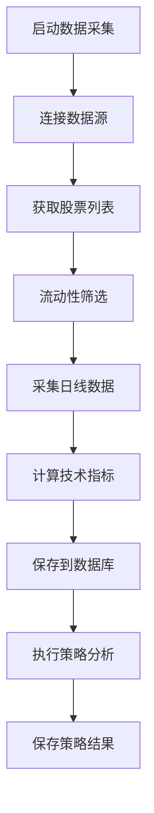

# 股票策略分析系统 v3 - 启动指南

## 📋 问题诊断：为什么数据库没有数据？

### 当前状态分析
根据代码分析，数据库没有数据的原因可能是：

1. **数据采集程序从未执行过**
   - 程序需要手动启动才能采集数据
   - 定时任务模式需要程序持续运行

2. **数据库连接配置问题**
   - 数据库可能未正确创建
   - 连接参数可能不正确

3. **数据源API访问问题**
   - BaoStock/AKShare API可能需要认证
   - 网络连接问题

## 🚀 快速启动步骤

### 步骤1: 检查数据库状态

```bash
# 进入项目目录
cd E:\myproject\stock-v3

# 检查数据库连接
python scripts/init_database.py
```

### 步骤2: 初始化数据库和数据采集

```bash
# 方法1: 使用初始化脚本（推荐）
python scripts/init_database.py

# 方法2: 手动执行数据采集
cd data/python
python run_data_collection.py init 30
```

### 步骤3: 验证数据采集结果

```bash
# 检查数据状态
cd data/python
python run_data_collection.py status

# 测试数据采集功能
python run_data_collection.py test
```

## 🔧 详细启动流程

### 1. 数据库初始化

#### 检查数据库连接
```bash
python scripts/init_database.py
```

**预期输出**:
```
开始数据库初始化流程...
正在测试数据库连接...
数据库连接测试成功
开始创建数据库表结构...
数据库表结构创建完成
开始填充初始数据...
步骤1: 采集股票基本信息
获取到 5000+ 只股票基本信息
股票基本信息保存完成
...
数据库初始化完成!
```

#### 如果数据库连接失败
1. **检查PostgreSQL服务是否运行**
2. **检查数据库配置**：`backend/config.yaml`
3. **手动创建数据库**：
```sql
CREATE DATABASE stock_strategy;
CREATE USER postgres WITH PASSWORD 'password';
GRANT ALL PRIVILEGES ON DATABASE stock_strategy TO postgres;
```

### 2. 数据采集执行

#### 首次启动（采集历史数据）
```bash
cd data/python

# 采集30天历史数据
python run_data_collection.py init 30

# 或者采集更长时间的历史数据
python run_data_collection.py init 365
```

**执行内容**:
- ✅ 获取所有A股股票基本信息
- ✅ 采集行业分类数据
- ✅ 采集指定天数的历史日线数据
- ✅ 执行今日数据采集
- ✅ 保存所有数据到数据库

#### 日常数据采集
```bash
# 每日执行一次数据采集
python run_data_collection.py daily

# 或者使用定时任务模式
python run_data_collection.py schedule
```

### 3. 验证数据采集结果

#### 检查数据状态
```bash
python run_data_collection.py status
```

**预期输出**:
```
数据源可获取股票数量: 5000+
BaoStock连接正常
数据采集测试成功，获取到股票 000001 的日线数据
```

#### 测试数据采集功能
```bash
python run_data_collection.py test
```

## 📊 数据采集逻辑详解

### 采集时间安排

#### 首次启动
- **立即执行**: 采集历史数据（可指定天数）
- **数据范围**: 从指定天数前到今天的所有数据
- **执行方式**: 手动执行 `python run_data_collection.py init [days]`

#### 日常运行
- **定时执行**: 每日17:45自动执行
- **数据范围**: 当日最新数据
- **执行方式**: 
  - 手动执行: `python run_data_collection.py daily`
  - 定时任务: `python run_data_collection.py schedule`

### 数据采集流程



### 采集的数据类型

1. **股票基本信息**
   - 股票代码、名称、行业分类
   - 上市日期、市场类型

2. **日线数据**
   - 开盘价、最高价、最低价、收盘价
   - 成交量、成交额、换手率
   - 市盈率、市净率

3. **技术指标**
   - 移动平均线（MA5/10/20/60）
   - 成交量均线
   - RSI、MACD等指标

4. **行业分类数据**
   - 申万行业分类
   - 板块资金流向

## ⚠️ 常见问题解决

### 问题1: "数据库连接失败"

**解决方案**:
1. 检查PostgreSQL服务是否启动
2. 验证数据库配置参数
3. 检查防火墙设置

### 问题2: "数据源API连接失败"

**解决方案**:
1. 检查网络连接
2. 验证BaoStock/AKShare API密钥
3. 尝试使用备用数据源

### 问题3: "数据采集返回空结果"

**解决方案**:
1. 检查数据源是否正常返回数据
2. 验证股票代码格式
3. 检查数据采集时间范围

### 问题4: "策略执行无结果"

**解决方案**:
1. 确认数据库中有足够的日线数据
2. 检查策略参数设置
3. 验证技术指标计算是否正确

## 🔄 自动化部署建议

### Docker容器化部署
```yaml
# docker-compose.yml
version: '3.8'
services:
  postgres:
    image: postgres:13
    environment:
      POSTGRES_DB: stock_strategy
      POSTGRES_USER: postgres
      POSTGRES_PASSWORD: password
    volumes:
      - postgres_data:/var/lib/postgresql/data

  data-collector:
    build: ./data/python
    command: python run_data_collection.py schedule
    depends_on:
      - postgres

  backend:
    build: ./backend
    ports:
      - "8080:8080"
    depends_on:
      - postgres
      - data-collector

  frontend:
    build: ./frontend
    ports:
      - "3000:3000"
    depends_on:
      - backend

volumes:
  postgres_data:
```

### 定时任务配置
```bash
# 使用crontab设置每日定时任务
# 每天17:45执行数据采集
45 17 * * * cd /path/to/stock-v3/data/python && python run_data_collection.py daily
```

## 📈 数据质量监控

### 监控指标
- **数据完整性**: 每日应采集5000+只股票数据
- **数据时效性**: 数据应在交易日结束后1小时内更新
- **数据准确性**: 价格数据应与交易所数据一致

### 日志检查
```bash
# 查看数据采集日志
tail -f data_collection.log

# 查看数据库操作日志
tail -f database_init.log
```

## 🎯 下一步操作

完成数据采集后，可以：

1. **启动后端服务**: `cd backend && go run main.go`
2. **启动前端服务**: `cd frontend && npm run dev`
3. **访问系统**: http://localhost:3000
4. **执行策略**: 通过API接口执行策略分析

---

**注意**: 首次启动需要采集历史数据，可能需要较长时间（30天数据约需10-30分钟）。请确保网络连接稳定，数据库有足够存储空间。